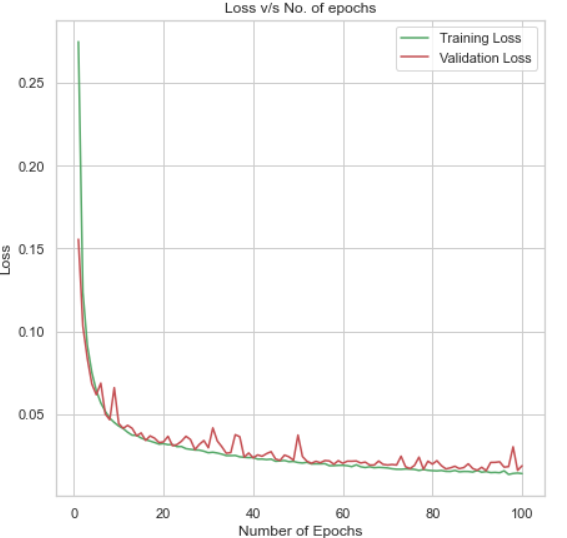
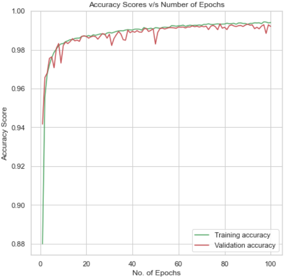
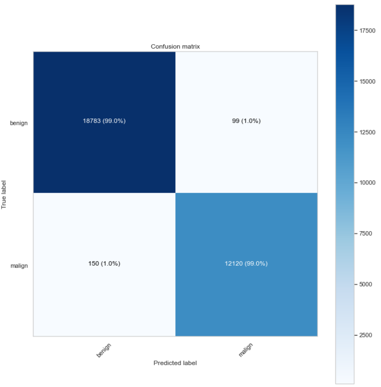

<div id="top"></div>

# Comprehensive Approach to DDoS Attack Detection using Machine and Deep Learning Models
[![Contributors][contributors-shield]][contributors-url]
[![Forks][forks-shield]][forks-url]
[![Stargazers][stars-shield]][stars-url]
[![Issues][issues-shield]][issues-url]
[![LinkedIn][linkedin-shield]][linkedin-url]


This work is about exploring the different algorithms in order to facilitate the detection of Distributed Denial of Service (DDoS) attacks.

## Table of contents
<ol>
  <li>
    <a href="#project-description">Project Description</a>
  </li>
  <li>
    <a href="#details-of-algorithms-used">Details of algorithms used</a>
  </li>
  <li>
    <a href="#dataset-description">Dataset Description</a>
  </li>
  <li>
    <a href="#project-structure">Project Structure</a>
  </li>
  <li>
    <a href="#getting-started">Installation Steps</a>
  </li>
  <li>
    <a href="#results">Results</a>
  </li>
   <li>
    <a href="#contributions">Contributions</a>
  </li>
   <li>
    <a href="#contact">Contact</a>
  </li>
</ol>
<p align="right">(<a href="#top">back to top</a>)</p>

## Project Description
<p align = "justify">
With the increase in technological advancement, especially the internet, there come various kinds of network attacks. DOS attacks pose one of the most challenging security threats in today’s generation of internet. In addition, the Distributed Denial of Service (DDoS) attacks are of a particular concern whose impact can be proportionally severe. The challenging part of this attack is that it comes with little or no advance warning and could easily exhaust away the communication or computation resources of the victim in a short span of time. These attacks are becoming advanced day-by-day and are increasing in number thus making it difficult to detect and counter such attacks. In addition to detecting the upsurge of packets during DDoS attack using Wireshark, we have used numerous Machine Learning techniques for effective detection of DDoS flooding attack such as K-Nearest Neighbors, SGD, Multi-layer Perceptron, Logistic Regression, Naive Bayes, Support Vector Machine, XGBoost, Decision Tree, Quadratic discriminant and deep learning techniques such as DNN etc. A detailed comparative analysis of the aforementioned algorithms is performed and is evaluated based on the accuracy metrics.
<p align="right">(<a href="#top">back to top</a>)</p></div><p>

## Details of algorithms used
<br>

#### Naïve Bayes Classifier
<p align = "justify">
Naïve Bayes classifier is a simple probabilistic ML model that calculates the probabilities for each class in a dataset and adopts discriminative learning to predict values of the new class. It is based on Bayes theorem; assuming the features to be independent, we can find the probability of A (hypothesis) happening given that B (evidence) has occurred. It is naïve as the presence of one predictor/feature does not affect the other.
</p>
<br>

#### Decision Tree
<p align = "justify">
Decision Tree belong to the class of non-parametric supervised learning method. It is mainly used for the purpose of solving the regression and the classification problems. The major aim is to build a model which predicts the value of a target variable which is done by learning the simple decision tree rules that are inferred from the features of the data. The tree is seen as a piecewise constant approximation. For solving the classification problem, the class DecisionTreeClassifier is used. The class is well equipped to perform a multi-class classification on the dataset. The classifier takes two arrays as input: an array X or dense, having shape (n_samples, n_features) which hold the training samples of the dataset, and an array Y which have integer values having shape (n_samples) which hold the class labels of the corresponding training samples. After model 
fitting, the model is used for making predictions of class of the samples. In the case of multiple classes with the exact same and highest probability, the classifier 
tends to predict the class which has the lowest index among the classes. Besides outputting to a specific class, the probability of each class could be predicted 
which constitutes the fraction of the training sample of the class in a leaf. The classifier is capable for classifying both multi-class classification and binary lassification.
</p>
<br>

#### Deep Neural Networks
<p align = "justify">
One of the most well-known and recent models is the Deep Neural network which can be considered as a stack of neural networks i.e., a network composed of several layers. DNN has been successfully applied in several applications, including regression, classification, or time series prediction problems using simple auto-regressive models. The architecture comprises of at least 3 layers of nodes namely input layer, hidden layer and output layer which are interconnected; the flow of data takes place via one direction from input nodes to output node. Further DNN uses backpropagation as the training algorithm and activation function (usually sigmoid) for classification process. We train a deep neural network to classify normal and DDoS attack states by using a carefully chosen set of network statistics as an input signal.
</p>
<br>

#### Stochastic Gradient Descent Classifier
<p align = "justify">
This Classifier implements regularized linear models such as SVM, logistic regression, etc. by making use of Stochastic gradient descent (SGD) optimization technique in the training process. The gradient of the loss for each sample is calculated by this optimizer at a time and the model is updated by estimating minimum cost function which is obtained with a decreasing learning rate or strength schedule. SGD Classifier is an efficient estimator for large scale problems as it allows minibatch learning via the partial fit method. Simple linear classifiers don’t work if the records cannot be kept in RAM, however SGD classifier continues to work. This model is sensitive to feature scaling and require fine tuning of many hyperparameters such as number of iterations and regularization parameter for a good performance.
</p>
<br>

#### K-Nearest Neighbors
<p align = "justify">
K-Nearest Neighbor (K-NN) is one of the simplest Supervised Machine Learning algorithms which presumes the similarity between existing data and new data and put the new case into the category that is most like the available ones. It classifies a new data point based on the similarity of stored available data i.e., when any new data appears then it can be easily classified into a well-suited category by using K- NN algorithm. The KNN classifier has the ability to effectively detect invasive attacks as well as achieve a low fall-out ratio. It can distinguish between the normal and abnormal behavior of the system and is used to classify the status of networks to each phase of DDoS attack.
</p>
<br>

#### Support Vector Machine
<p align = "justify">
Support Vector Machines (SVM) is one of the most favored ML algorithms for many applications, such as pattern recognition, spam filtering and intrusion detection. There are several SVM formulations for regression, classification, and distribution estimation. It is derived from linearly separable and the most optimal classification hyperplane. There is a training set D = {(X1, y1), (X2, y2) …. (Xn, yn)}, where Xi is the characteristic vector of the training sample and yi is the associated class label. takes +1 or −1 (y belongs to {+1, -1}) indicating that the vector belongs to this class or not. It is said to be linearly separable if there exists a linear function that can separate the two categories completely; otherwise, it is nonlinearly separable. As DDoS attack detection is equivalent to that of a binary classification problem, we can use the characteristics of SVM algorithm collect data to extract the characteristic values to train, find the optimal classification hyperplane between the legitimate traffic and DDoS attack traffic, and then use the test data to test our model and get the classification results.
</p>
<br>

#### Random Forest
<p align = "justify">
The Random Forest classifier makes use of ensemble learning technique as it constitutes of many decision trees. All the individual trees present as a part of random forest provide a class prediction. Subsequently, the class with the highest number of votes becomes the prediction of the entire model. The core idea of the classifier is to have a significant number of trees which operate together as a whole to outperform any of the individual constituent models. The key is low correlation between the models. Uncorrelated models have the capability to produce more accurate models than any of the individual predictions. The main reason is that the trees protect one another from individual errors. While some trees might be wrong, if many other trees are right, then, the group of trees would be able to move towards the right direction. The classifier makes use of feature randomness and bagging to build each individual tree to create an uncorrelated forest of trees.
</p>
<br>

#### XGBoost Classifier
<p align = "justify">
XGboost is a classifier which is based on the decision-tree-based ensemble machine learning. It makes use of a gradient boosting framework. For the prediction of unstructured data such as images, text etc. the artificial neural network tends to perform better as compared to the other frameworks or algorithms. However, decision tree-based algorithms are considered to be the best when it comes to the small-to-medium structured/tabular data. The algorithm is based on the base GBM framework by algorithmic enhancements and system optimizations. In other words, it is an optimized gradient boosting algorithm which makes use of tree pruning, parallel processing, tree pruning and handling of the missing values and makes use of regularization in order to avoid bias and overfitting.
</p>
<br>

#### Quadratic Discriminant Analysis
<p align = "justify">
In Quadratic Discriminant Analysis (QDA), each class follows a Gaussian distribution and is generative. It is very much like that of Linear Discriminant Analysis with the exception that the covariance and mean of all the classes are equal. The class specific prior refers to the proportion of the data points which belong to that class. The class specific covariance matrix refers to the covariance of the vectors which belong to that class. The class specific mean vector refers to the average of the input variables which belong to that class.
</p>
<br>

#### Logistic Regression
<p align = "justify">
Logistic Regression is a statistical method used for binary classification problems. It is a supervised learning algorithm that predicts the probability of an instance belonging to a particular class. Logistic Regression models the relationship between a binary dependent variable (target) and one or more independent variables (features). It uses the logistic function, also known as the sigmoid function, to map predicted values to probabilities between 0 and 1. Logistic Regression can be extended to handle multiple classes using techniques like one-vs-all (OvA) or one-vs-one (OvO) strategies.
</p>

<p align="right">(<a href="#top">back to top</a>)</p>

## Dataset Description
<p align = "justify">
The DDoS attack dataset is a SDN specific dataset that is generated by making use of the mininet emulator and is mainly used for the classification of traffic by numerous deep learning and machine learning algorithms. The process involved for the creation of the dataset includes the creation of ten topologies in mininet where the switches were connected to a single Ryu controller. The network simulation runs for the both the benign UDP, ICMP and TCP traffic as well as the collection of malicious traffic for TCP Syn attack, ICMP attack and UDP flood attack. The dataset includes 23 features in total where some of the data is extracted from the switches and others were calculated.
</p>
Extracted features which are present in the dataset include: -
<ul>
<li>Packet Count (pktcount) – refers to the count of packets <br/></li>
<li>Byte Count (bytecount) – refers to the count of bytes in the packet <br /></li>
<li>Switch Id (Switch) – ID of the switch <br /></li>
<li>Duration in seconds (dur) – packet transmission (in seconds) <br /></li>
<li>Duration in nanoseconds (dur_nsec) – packet transmission (in nanoseconds) <br /></li>
<li>Total Duration (tot_dur) – sum of duration_sec and durstaion_nsec <br /></li>
<li>Source IP (src) – IP address of the source machine <br /></li>
<li>Destination IP (dst) – IP address of the destination machine <br /></li>
<li>Port Number (port_no) – Port number of the application <br /></li>
<li>Bytes Transferred (tx_bytes) – number of bytes transferred from the switch port <br />
<li>Bytes Received (rx_bytes) – number of bytes received on the switch port <br />
<li>DateTime field (dt) – shows the date and time which has been converted into a number and the flow is monitored at a monitoring interval of 30 seconds<br /></li>
<li>Flows (flows) - total flow entries<br></li>
<li>Pairflow (Pairflow) - gives the pairflow value</li>
<li>Protocol (Protocol) - protocol type (tcp, udp, icmp)<br></li>
</ul>

The calculated features present in the dataset include: -
<ul>
<li>Byte Per Flow (byteperflow) – byte count during a single flow<br /></li>
<li>Packet Per Flow (pktperflow) – packet count during a single flow<br /></li>
<li>Packet Rate (pktrate) – number of packets transmitted per second and calculated by dividing the packet per flow by monitoring interval<br /></li>
<li>No. of Packet_ins Messages (packetins) – messages that are generated by the switch and is sent to the controller <br /></li>
<li>Flow Entries of Switch (flows) – entries in the flow table of a switch which is used to match and process packets<br /></li>
<li>Transmission Speed (tx_kbps) – Speed of packet transmission (in kbps)<br /></li>
<li>Reception Speed (rx_kbps) - Speed of packet reception (in kbps)<br /></li>
<li>Total Speed (tot_kbps) - Sum of packet transmission and reception speed (in kbps)<br /></li>
<li>Port Bandwidth – Sum of tx_kbps and rx_kbps<br /></li>
</ul>


The output feature is the last column of the dataset i.e. class label which classifies the traffic type to be benign or malicious. The malicious traffic is labelled as 1 and the benign traffic is labelled as 0. The simulation of the network was run for approximately 250 minutes and 1,04,345 instances of data were collected and recorded. Further, the simulation was run for a given interval to collect more instances of data.

The DDoS attack SDN dataset could be downloaded using the [Link](https://data.mendeley.com/datasets/jxpfjc64kr/1)
<p align="right">(<a href="#top">back to top</a>)</p>

## Project Structure
    DDoS-Detection-main
        ├── dataset_sdn.csv # dataset file
        ├── Machine Learning Based DDOS Detection.ipynb # ipynb having the source code
    ├── requirements.txt
    ├──README.MD
    ├──images/
       ├──icons/ # sample icons
       ├──plots/ # result plots
    
<p align="right">(<a href="#top">back to top</a>)</p>

## Installation Steps
1. Clone the repository to your local directory by entering the following command:
      ```sh
      https://github.com/AnshumanMohanty-2001/DDoS-Detection.git
      ```

2. After navigating inside the project directory, we need to type in the command: 
      ```sh
      conda create -n venv
      ```
    Here, venv is the name of virtual environment.


3. Upon creation of the virtual environment, the following command needs to be entered to activate the virtual environment.
      ```sh
      conda activate venv
      ```

4. The following command installs the required libraries: 
      ```sh
      pip install -r requirements.txt
      ```

5. Install ipykernel which provides the IPython kernel for Jupyter:
    ```sh
   pip install --user ipykernel
    ```

6. Add your virtual environment to Jupyter by typing:
    ```sh
   python -m ipykernel install --user --name=venv
    ```

7. Download the dataset and place it in accordance to the project structure.

8. Execute the jupyter notebook.
<p align="right">(<a href="#top">back to top</a>)</p>

## Results
### Accuracy Results of all Algorithms
| <b>Algorithm</b>    | <b>Accuracy (%)</b> |
|---------------------|---------------------|
| DNN                 | 99.38               |
| XGBoost             | 98.18               |
| SVM                 | 97.44               |
| Decision Tree       | 96.63               |
| KNN                 | 96.45               |
| SGD                 | 83.91               |
| Logistic Regression | 83.69               |
| Naive Bayes         | 71.31               |
| QDA                 | 50.14               |

### Accuracy of Proposed DNN Model Before and After Hypertuning

| <b>Proposed DNN</b> | <b>Accuracy (%)</b> |
|---------------------|---------------------|
| Before Hypertuning  | 99.18               |
| After Hypertuning   | 99.38               |


<br>

<p align = "center">
<br>
<b>Plot for Loss v/s Number of Epochs</b>
</p>

<br>

<p align = "center">
<br>
<b>Plot for Accuracy v/s Number of Epochs</b>
</p>

<br>

<p align = "center">
<br>
<b>Final Confusion Matrix</b>
</p>

</center>
<p align = "justify">
DDoS attacks analysis and detection were performed using machine learning method. In this work, a SDN specific dataset is used. The dataset originally includes 23 features. The output feature is the last column of the dataset i.e. class label which classifies the traffic type to be benign or malicious. The malicious traffic is labelled as 1 and the benign traffic is labelled as 0. It has 104345 instances. The null values were observed in the rx_kbps and tot_kbps and were hence dropped for model development. The data processing steps were completed, including data preparation/cleaning, one Hot encoding, and normalization. After one hot encoding, the dataframe had 103839 instances with 57 features and was fed into the model.A Deep Neural Network was used as the proposed model. The efficacy of our proposed model was observed to be higher than that of the baseline classifiers used. The accuracy of our proposed model was observed to be 99.38% which is approximately 1.21% higher than the next best model XGBoost whose accuracy stands at 98.17%. Besides a 0.2% increase is observed in the model accuracy upon hypertuning parameters.
</p>
<p align="right">(<a href="#top">back to top</a>)</p>

## Contributions
<p align = "justify">
Contributions are what make open source such a fantastic environment to learn, inspire, and create. Any contribution you could provide to this existing work is much appreciated.
Please fork the repository or create a pull request if you have any suggestion for betterment. Subsequently, you could also open an issue for queries. Also, Don't forget to give the project a star!</p>
<p align="right">(<a href="#top">back to top</a>)</p>

## Contact
<a href="anshumohanty2002@gmail.com"></a>
&nbsp;&nbsp;<a href="https://github.com/AnshumanMohanty-2001"></a>
&nbsp;&nbsp;<a href="https://www.linkedin.com/in/anshuman-mohanty-b21b04231/"></a>
<p align="right">(<a href="#top">back to top</a>)</p>

[contributors-shield]: https://img.shields.io/github/contributors/AnshumanMohanty-2001/DDoS-Detection.svg?style=for-the-badge
[contributors-url]: https://github.com/AnshumanMohanty-2001/DDoS-Detection/graphs/contributors
[forks-shield]: https://img.shields.io/github/forks/AnshumanMohanty-2001/DDoS-Detection.svg?style=for-the-badge
[forks-url]: https://github.com/AnshumanMohanty-2001/DDoS-Detection/network/members
[stars-shield]: https://img.shields.io/github/stars/AnshumanMohanty-2001/DDoS-Detection.svg?style=for-the-badge
[stars-url]: https://github.com/AnshumanMohanty-2001/DDoS-Detection/stargazers
[issues-shield]: https://img.shields.io/github/issues/AnshumanMohanty-2001/DDoS-Detection.svg?style=for-the-badge
[issues-url]: https://github.com/AnshumanMohanty-2001/DDoS-Detection/issues
[linkedin-shield]: https://img.shields.io/badge/-LinkedIn-black.svg?style=for-the-badge&logo=linkedin&colorB=555
[linkedin-url]: https://www.linkedin.com/in/anshuman-mohanty-b21b04231/
